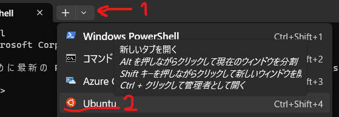

# Ubuntuの(開発環境としての)使い方  
##  立ち上げ方  
※インストールが終わった直後は勝手に立ち上がっているはずなのでこの手順は飛ばしていいです。  
ターミナルのＶボタンを押してUbuntuを選択するとWSLとUbuntuが立ち上がります。  
  

## Ubuntuでよく使うコマンド（最低限）  
※<>で囲んでいる部分は<>を外して書き換えてください。
### `pwd` 今いるディレクトリ(フォルダ)の場所を表示
```bash
例
katsu@K-Note03:~$ pwd
/home/katsu
```
### `ls/dir` 今いるディレクトリ配下のファイルを一覧表示[^1]  
```bash
例
katsu@K-Note03:~$ ls
Ansible  Clang  kubespray
katsu@K-Note03:~$ ls -a #隠しファイルも含めて全て表示
.  ..  .bash_history  .bash_logout  .bashrc  .cache  .motd_shown  .profile  Ansible  Clang  kubespray
```
### `mkdir <ディレクトリ名>` ディレクトリを作成  
```bash
例
katsu@K-Note03:~$ mkdir PeaCH
katsu@K-Note03:~$ ls
Ansible  Clang  PeaCH  kubespray
```
### `rm <ファイル名>` ファイルを削除 
`rm -r <ディレクトリ名>`でディレクトリを削除することもできます。 
```bash
katsu@K-Desktop01:~$ ls
Ansible  Clang  kubespray  peach.txt
katsu@K-Desktop01:~$ rm peach.txt
katsu@K-Desktop01:~$ ls
Ansible  Clang  kubespray
```
### `cd <ディレクトリ名>` 現在地を移動  
```bash
例
katsu@K-Note03:~$ cd PeaCH
katsu@K-Note03:~/PeaCH$
```
`cd ..`で一つ前のディレクトリに戻ることもできます。
```bash
例
katsu@K-Note03:~/PeaCH$ cd ..
katsu@K-Note03:~$
```
`cd` でホームディレクトリ(/home/user名)に戻ります。
```bash
katsu@K-Note03:~$ cd PeaCH
katsu@K-Note03:~/PeaCH$ cd
katsu@K-Note03:~$ pwd
/home/katsu
```
使いこなすためには「絶対パス」や「相対パス」、「正規表現」なども調べるといいです。  
### `sudo`コマンド  
別のユーザーの権限で直後のコマンドを実行するためのコマンドです。基本的に管理者(root)権限でコマンドを実行したいときに使用します。[^2]  
### `apt`コマンド  
APTというパッケージマネージャー（iOSのApp Store,AndroidのGoogle Playのようなもの[^3]）を使用するためのコマンドです。Ubuntuにソフトウェアを入れたり更新したりする際に使用します。基本的に管理者権限が必要なため先程出てきた`sudo`と併用します。  
#### `apt update` ソフトウェアの更新がないか確認
```bash
例 
katsu@K-Note03:~$ sudo apt update
[sudo] password for katsu: <パスワードを入力>
Hit:1 http://archive.ubuntu.com/ubuntu jammy InRelease
~~~ 略 ~~~
Fetched 27.9 MB in 7s (3797 kB/s)
Reading package lists... Done
Building dependency tree... Done
Reading state information... Done
105 packages can be upgraded. Run 'apt list --upgradable' to see them.
``` 
#### `apt upgrade` 更新できるソフトウェアを更新  
```bash
例
katsu@K-Note03:~$ sudo apt upgrade
Reading package lists... Done
~~~ 略 ~~~
The following packages will be upgraded:
  apport apt apt-utils base-files bind9-dnsutils bind9-host bind9-libs binutils binutils-common
~~~ 略 ~~~
105 upgraded, 0 newly installed, 0 to remove and 0 not upgraded.
56 standard LTS security updates
Need to get 91.0 MB of archives.
After this operation, 347 kB of additional disk space will be used.
Do you want to continue? [Y/n]
<yを押下>
~~~ 略 ~~~
0 added, 0 removed; done.
Running hooks in /etc/ca-certificates/update.d...
done.
```
`apt upgrade -y`で確認をスキップすることもできます。
#### `apt search <パッケージ名>` パッケージを検索  
```bash
例 GCCなどの開発者ツールを含むパッケージを検索
katsu@K-Note03:~$ sudo apt search build-essential
[sudo] password for katsu: <パスワードを入力>
Sorting... Done
Full Text Search... Done
build-essential/jammy 12.9ubuntu3 amd64
  Informational list of build-essential packages

~~~ 略 ~~~
```
#### `apt install <パッケージ名>`パッケージをインストール
```bash
例 GCCなどの開発者ツールを含むパッケージをインストール
katsu@K-Note03:~$ sudo apt install build-essential
Reading package lists... Done
Building dependency tree... Done
Reading state information... Done
~~~ 略 ~~~
After this operation, 208 MB of additional disk space will be used.
Do you want to continue? [Y/n] 
<yを押下>
Get:1 http://archive.ubuntu.com/ubuntu jammy-updates/main amd64 libc-dev-bin amd64 2.35-0ubuntu3.4 [20.3 kB]
~~~ 略 ~~~
```
`apt install <パッケージ> -y`で確認をスキップすることもできます。

### `code .`VSCを開く  
現在のディレクトリをVSCで開きます。MicrosoftはWSL上のディレクトリを直接Windowsから開くことを推奨していないので極力`code .`を使うようにしましょう。

## Ubuntuでよく使うコマンド（できれば知っておいてほしい）  
### `history` 入力した履歴を見る  
```bash
例
katsu@K-Note03:~$ history
    1  pwd
    2  ls
    3  dir
```
`!<番号>`で過去に実行したコマンドを再実行することができます。
```bash
例
katsu@K-Note03:~$ !2
ls
Ansible  Clang  PeaCH  kubespray
```
余談ですが、大抵のOSのターミナルでは矢印キーの上下を押すことで前に入力した内容に戻ったり進む事ができます。同じコマンドを実行するために毎回入力し直している人をよく見かけますが時間がもったいないので効率的にプログラミングするために工夫しましょう。  

### `cp <コピー元ファイル名> <コピー先ファイル名>` ファイルをコピー  
```bash
例
katsu@K-Desktop01:~$ ls
Ansible  Clang  aaa.txt  kubespray
katsu@K-Desktop01:~$ cp aaa.txt bbb.txt
katsu@K-Desktop01:~$ ls
Ansible  Clang  aaa.txt  bbb.txt  kubespray
```
### `mv <ファイル名> <ディレクトリ名>` ファイルの場所を移動  
```bash
例
katsu@K-Desktop01:~$ ls
Ansible  Clang  PeaCH  aaa.txt  bbb.txt  kubespray
katsu@K-Desktop01:~$ mv aaa.txt PeaCH
katsu@K-Desktop01:~$ ls
Ansible  Clang  PeaCH  bbb.txt  kubespray
katsu@K-Desktop01:~$ cd PeaCH
katsu@K-Desktop01:~/PeaCH$ ls
aaa.txt
```

### `vi/vim` テキストエディタ
vi/vimはWindowsで言うメモ帳のようなテキストエディタです。拡張機能（プラグイン）を追加することでVSCのように機能を追加することができます。癖がありますが様々な環境に実装されているコマンドなので覚えておくと便利です。ここではよく使う操作だけ説明します。  
`vim <ファイル名>` テキストファイルを開きます。存在しない場合は生成します。  
`i` 挿入モードに入って編集できるようになります。`ESC`で挿入モードから抜けます（ノーマルモードになる）  

※以下のコマンドを実行する前にノーマルモードになっているか確認するようにしてください。  
`Shift+Z２回` テキストファイルを保存して終了します。  
`:qa!` テキストファイルを保存せずに終了します。  
`/<検索したいワード>` ワードを検索します。`Enter`を押下してから`n`を押していくことで次にワードが一致する部分に飛ぶことができます。  
`:set number` 行数を表示します。

```bash
例
katsu@K-Note03:~$ vim peach.txt
<iキーで挿入モードに入ります>
<なんか適当に入力>
<ESCキーで挿入モードを終了>
<Shift+ZZでvimを終了>
```  
### `cat <ファイル名>` テキストファイルの中身を見る  
```bash
katsu@K-Desktop01:~$ cat peach.txt
Hello!
```

### `|` パイプ  
前のコマンドの出力結果を次のコマンドに橋渡しするコマンドです。  
`<前のコマンド> | 次のコマンド`  

### `grep <検索したい文字列>` 検索  
テキストファイルから指定した文字列（正規表現）に一致する行を検索して出力するコマンドです。先述したパイプと組み合わせることでコマンドの出力結果から文字列を検索することができます。   
```bash
例
katsu@K-Desktop01:~$ history | grep git
   87  git clone git@github.com:kubernetes-sigs/kubespray.git
   94  sudo git clone git@github.com:kubernetes-sigs/kubespray.git
  113  git pull
```

### `>/>>/<` リダイレクション
`<コマンド> > <ファイル名>` コマンドの出力結果をファイルに書き込む（上書き）  
`<コマンド> >> <ファイル名>` コマンドの出力結果をファイルに書き込む（追記）  
`<コマンド> < <ファイル名>` コマンド実行中の入力にファイルの中身を入れる[^4]  
```bash
katsu@K-Desktop01:~$ cat peach.txt > redirection1.txt #上書き
katsu@K-Desktop01:~$ cat redirection1.txt
Hello!
katsu@K-Desktop01:~$ cat peach.txt >> redirection1.txt #追記
katsu@K-Desktop01:~$ cat redirection1.txt
Hello!
Hello!
katsu@K-Desktop01:~$ cat peach.txt > redirection1.txt #上書き
katsu@K-Desktop01:~$ cat redirection1.txt
Hello!
```

### `echo <文字列>` 復唱  
直後の文字列を出力します。  
```bash
katsu@K-Desktop01:~$ echo 進捗どうですか?
進捗どうですか?
```
  
以上でこの章を終わります。Ubuntuで使えるコマンドは他にも色々あるのでぜひ調べてみてください。また、一部のコマンドはWindowsや他のOSでも使えるので試してみると面白いかもしれません。  

[^1]: 世の中には`sl`とtypoした人のための特別なコマンドが存在します。`sudo apt install sl -y`で今すぐインストール！  
[^2]: 使用するユーザーごと管理者権限に切り替えたいときは`sudo su -`で切り替えます。  
[^3]: コマンドで操作するのでHomebrewやWinGetの方が操作感が近いかも。apt以外にもUbuntuではsnapやFlatpakなど様々なパッケージマネージャーを使うことができます。  
[^4]: 今回は長くなるので説明を省きますが、C言語のscanfを複数回用いるプログラムのデバッグ時などに使うと便利です。  

## 参照  
[Linuxコマンドで使われるパイプ（|）の使い方を詳しくご紹介！ GMOクラウドアカデミー](https://academy.gmocloud.com/know/20210630/12090)  
[grep wikipedia](https://ja.wikipedia.org/wiki/Grep)   
[入出力のリダイレクションとパイプ 慶應義塾大学SFC](https://web.sfc.keio.ac.jp/~manabu/command/contents/pipe.html)  
