<script type="module">
  import mermaid from 'https://cdn.jsdelivr.net/npm/mermaid@10/dist/mermaid.esm.min.mjs';
  mermaid.initialize({ startOnLoad: true });
</script>

# Git/GitHub講習 -インストールから軽い使い方まで

香月　亮祐

---

## Gitって何？

<div class="flex">

<div>
プログラムを作るとき，プログラムのソースコードを簡単に遡って見ることがができたら良いなと思ったことはありませんか？また，同じソースコードから複数の書き方，アルゴリズムを試してみたいと思ったことはありませんか？

手動でファイル名やフォルダを変えてコピーするような方法でそういった操作を実現するのは面倒ですが，Gitを使うと簡単に行うことができます．
</div>

<div style="font-size: 0.8em">

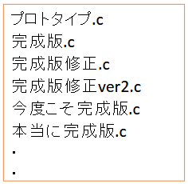
↑Gitを使わないと...

</div>

</div>
<!-- /.flex -->

---

## Gitの概念

実務でGitを扱うためによく使う用語と概念を説明します．  
(実際のGitの挙動とは違う部分があります．分かりやすい捉え方だけ説明しています．詳細を知りたい方は[このサイト](https://git-scm.com/docs)を参考にしてください．)
大雑把な説明しかしていないので実際に使う前に[ProgateのGitコース](https://prog-8.com/courses/git)や[サル先生のGit入門](https://backlog.com/ja/git-tutorial/)を受講することをおすすめします．

---

### repository(リポジトリ)

一旦Gitの仕組みや挙動を無視して「１つのプロジェクトのフォルダ」のことだと思っておけばいいです．(実際はファイルの変更履歴等も含まれています)  
ローカル(手元)のPCに保存する「ローカルリポジトリ」とサーバー上に保存する「リモートリポジトリ」があります．

### init

ローカルリポジトリを１から作るときは，`git init`コマンドをローカルのプロジェクトディレクトリで使用します．

```bash
cd プロジェクトのディレクトリ
git init
```

---

### add(アド)

ローカルリポジトリ内の選択したファイル・フォルダをgitの管理下に置きます．既にgitの管理下にあるファイル・フォルダの場合更新内容を追加します．

```bash
git add tekitou.c
```

### commit(コミット)

addでgitの管理下に置いたファイル・フォルダのその時点の状態をすべて保存します．

```bash
git commit -m "tekitou.cを追加"
```

<div class="mermaid">
gitGraph
 commit id: "tekitou.cを追加"
 commit id: "tekitou.cに関数xxを追加"
 commit id: "tekitou.cに関数〇〇を追加"
 commit id: "wakaran.cを追加"
</div>

---

### Push(プッシュ)

ローカルリポジトリのそれまでのコミットをリモートリポジトリに反映します．

```bash
git push
```

---

### Fetch(フェッチ)

```bash
git fetch
```

### Pull(プル)

リモートリポジトリの変更点をローカルリポジトリに反映します．

```bash
git pull
```

### Merge（マージ）

ブランチを統合します．

```bash
git merge main #mainブランチと現在選択中のブランチを統合
```

---

### clone(クローン)

リモートリポジトリを履歴も含めて全てローカルにコピーします．コピーしてローカルに保存されたリポジトリがローカルリポジトリです．

---

## GitHubって何？

リモートリポジトリやGitと組み合わせて使うと便利な機能などを提供しているサービスです．
Pull requests(プルリクエスト)やIssues(イシュー)といった機能を聞いたことがあるかもしれません．

- Tips: GitHubが提供しているもの以外にもリモートリポジトリは存在します．GitLabが提供しているものや自分でサーバーを設定して動かすものなど色々あります．

---

## Gitのインストール

### インストール済みか確認

Gitをインストールしているか確認するために，ターミナルで`git -v`と入力してください．すでにインストールされている場合は，下のようにバージョンが表示されます．

```bash
❯ git -v
git version 2.39.5 (Apple Git-154)
```

ここで`command not found:git`のような表示が出る場合はインストールされていないので次のスライドを参考にインストールしてください．

---

## Gitのインストール

※ インストールが完了したらターミナルを再起動してください

### Windowsの場合

Windows10の後期から標準搭載のパッケージマネージャー`Winget`を使います．

```bash
winget install Git.Git
```

### macOSの場合

macOSでよく使われるパッケージマネージャー[`Homebrew`](https://brew.sh/)を使います．  
インストールしていない方は先に`/bin/bash -c "$(curl -fsSL https://raw.githubusercontent.com/Homebrew/install/HEAD/install.sh)"`でインストールしてください．

```zsh
brew install git
```

---

## SSH認証

Git(アプリケーション)とGitHub(サービス)の紐づけ

---

## SSH認証

ブラウザで[GitHubの設定ページ](https://github.com/settings/keys)を開き既にSSH認証が設定されていないか確認します．既に設定されていたらSSH認証の章を飛ばしてください．

#### [GitHubのSSH認証設定ページ](https://github.com/settings/keys)を開く方法

①GitHubにログインして右上のアイコンをクリックする  
②Settingsをクリックする  
③SSH & GPG keysをクリックする  
④SSH認証を設定する予定のPCが既に設定されていないか確認する
<div class="flex">

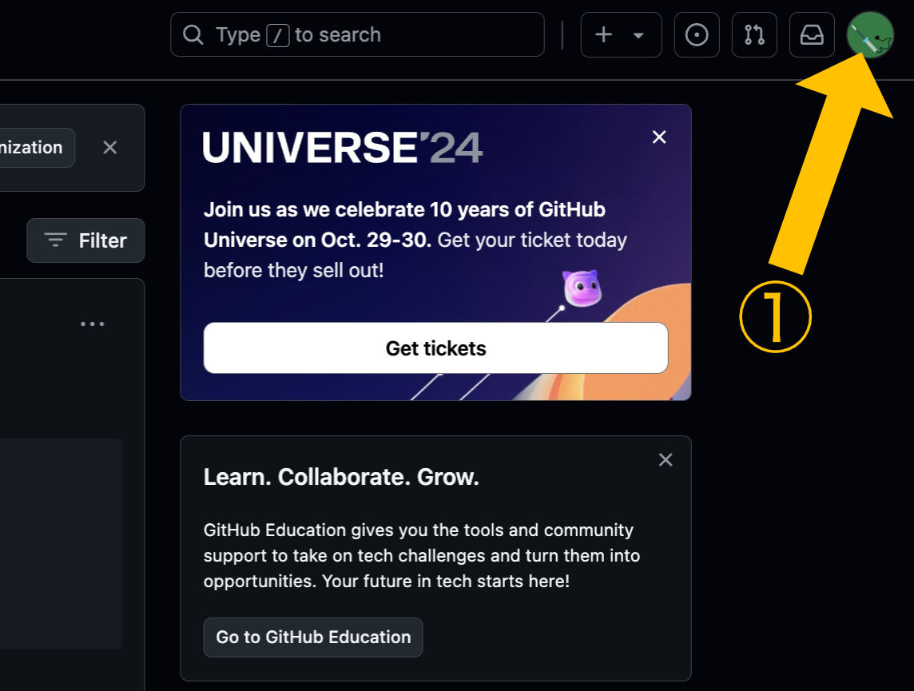

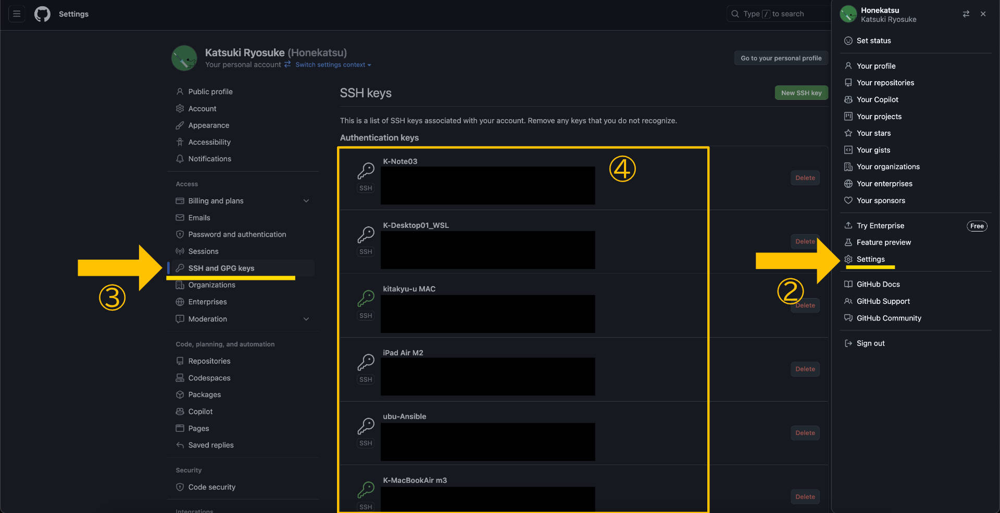

</div>

---

## SSH認証

### メールアドレス非表示用アドレスを確認

クリップボードにコピーする

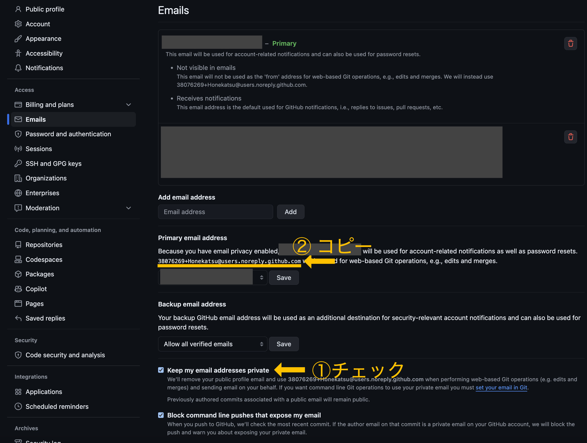

---

## SSH認証

### CLIでGitの設定

```bash
git config --global user.name "名前"
git config --global user.email "さっき②でコピーしたアドレス"
git config --global core.quotepath false #マルチバイト文字(日本語など)を使えるようにする
```

### CLIで認証用秘密鍵・公開鍵の生成

```bash
cd ~/.ssh #無い場合　mkdir ~/.sshしてからcd ~/.ssh
ssh-keygen -t ed25519 -C "ホスト名(PCの識別子)" #コメントだから何でもいい, 学校用のノートPC01とか
Enter連打
cat id_ed25519.pub # クリップボードに出力結果を全部コピー
```

- Tips: ed25519は公開鍵暗号の一種です．主流の暗号はコンピュータの処理能力の向上や技術の発展に合わせて数年おきに変わるので確認するようにしましょう．

---

## SSH認証

### 生成した公開鍵をGithubの「Setting.SSH and GPG keys」に貼り付け①

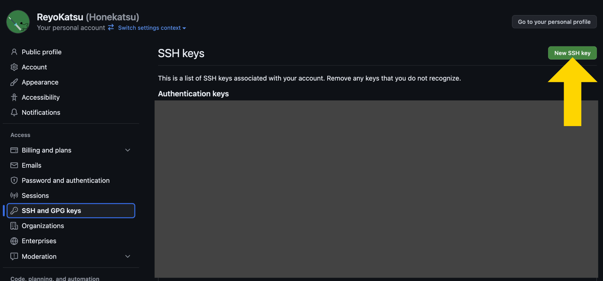

---

## SSH認証

### 生成した公開鍵をGithubの「Setting.SSH and GPG keys」に貼り付け②

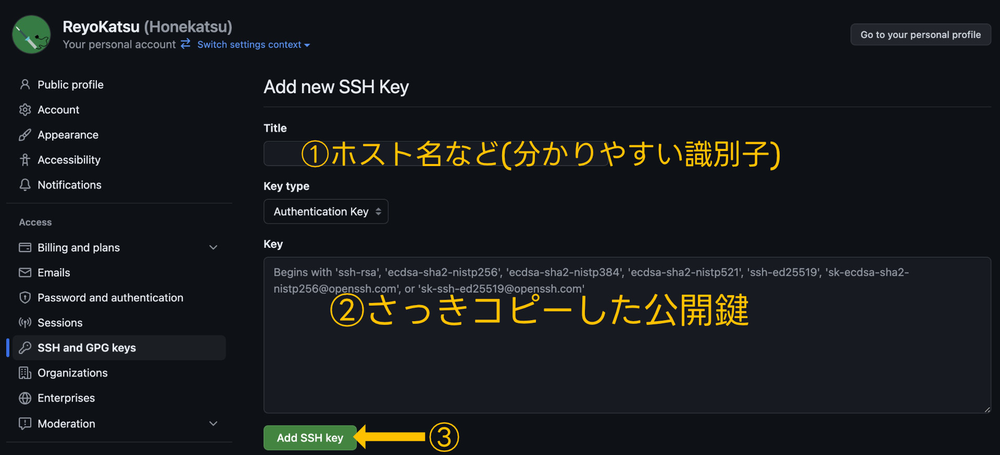

---

## SSH署名

ユーザーの正当性を証明する ※やらなくてもいい

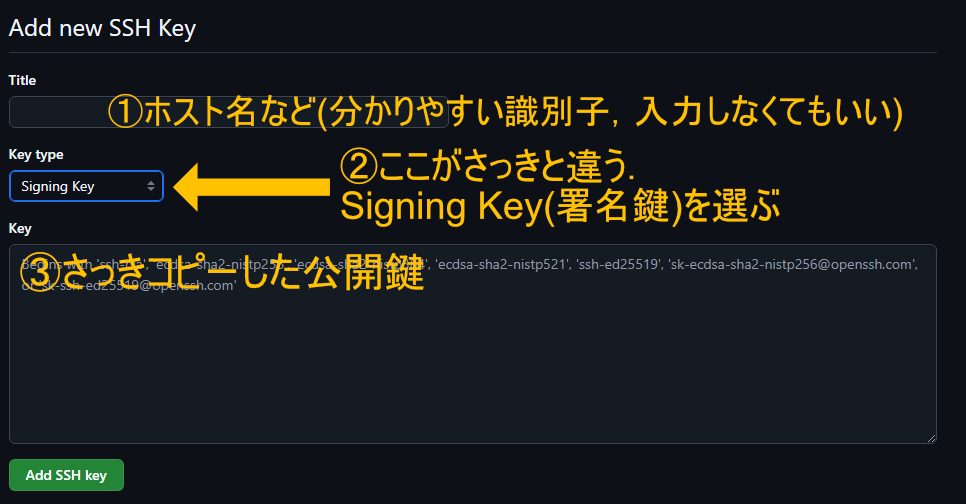

```bash
git config --global gpg.format ssh
git config --global user.signingkey ~/.ssh/id_ed25519.pub
```

---

## Gitの使い方(CLI)，コマンド

※ターミナルを開きプロジェクトディレクトリ内で実行する

### `git init`

gitの管理対象に現在のディレクトリを追加する
※プロジェクト作成後１回だけ実行

### `git add -A`

プロジェクトディレクトリ内の全てのディレクトリ・ファイルを管理対象に追加(.gitignoreに追加されているものは除く)

### `git commit -m "コメント"`

addしたディレクトリ・ファイルの現時点の状態を保存

---

## Gitの使い方(CLI)・リモートリポジトリ

### GitHubのサイト上でリモートリポジトリを作成する

①

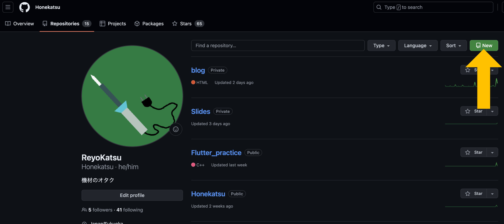

---

### 既に存在するディレクトリをGitHubへ

```bash
git remote add origin <url>
git branch -M main
git push -u origin main
```

---

## Gitのワークフロー，ブランチ戦略

- git-flow
- GitHub Flow
- GitLab Flow

---

## GitHubの使い方

以下の操作は，操作したいリポジトリのページから行ってください．

---

### Issues

Issue(イシュー)とは，GitHub上で主にプロジェクトに対する要望を出すときに使う機能です．

Issueの作り方は[GitHub Docs](https://docs.github.com/ja/issues)を参照してください．

Issueに追加したい機能などの要望を書いた後はIssueに紐づけたブランチを作成して作業に入ります．(↓Issueからブランチを作る方法)

<div class="flex">
①

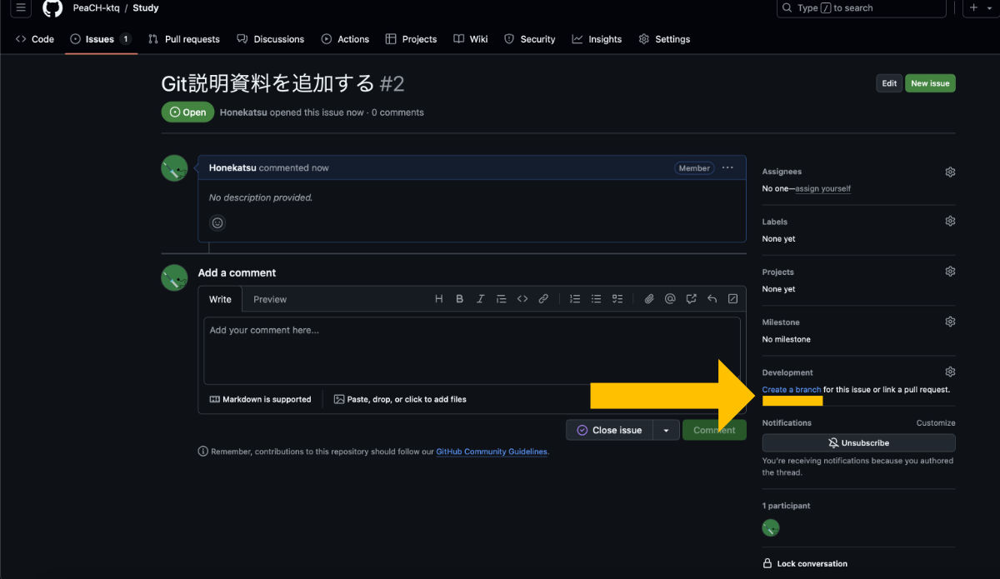

②

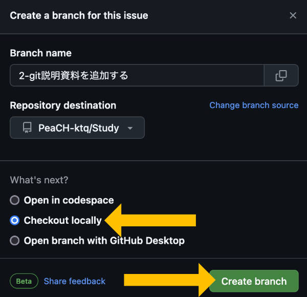

③

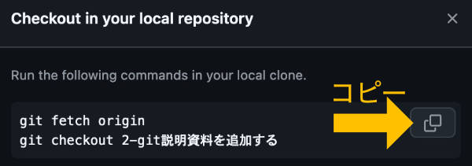
</div>

---

### Pull requests

作成したブランチに対する変更点を他のブランチに統合したいときに使う機能です．

### レビュー

---

## ツールの紹介

---

## ツールの紹介

### [Fork](https://git-fork.com/)

GUIでGitリポジトリを扱えるクライアント

#### インストール方法

Windows

```bash
winget install -h Fork.Fork
```

Mac(Homebrew)

```bash
brew install fork
```

---

## ツールの紹介

### VSCodeの拡張機能

[GitLens — Git supercharged](https://marketplace.visualstudio.com/items?itemName=eamodio.gitlens)

VSCodeでファイルのコミット履歴を見ることができる
他にも色々機能あるらしい
