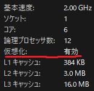

# トラブルシューティング  
WSLは（無理やりWindows上でLinuxを動かしている以上仕方ないですが）インストールの段階からインストールできない、正常動作しないなどのトラブルに見舞われることが多いように感じます。普通のソフトウェア以上に考えられる原因が多くトラブルの種類が多岐にわたるためここでは実際に遭遇したトラブルと解決策のみ追記していきます。  
## CPUの仮想化機能が有効になっていない  
WSLはCPUの仮想化機能を使用してLinuxを動かしているためこれが無効になっていると動作しません。タスクマネージャーのCPUのタブを見ることで確認できます。  
  
もし有効化できていなければPCのBIOSやUEFIから有効化する必要があります。PCのメーカーによって手順が異なるので各自で調べてください。[^1]  
## スマホエミュレータと一緒に使えない  
Androidのエミュレータと一緒に動かそうとすると仮想化機能が競合して正常に動作しないことがあります。回避する機能がついているエミュレータなら動作するかもしれません。  
## 起動時にエラーが出て停止する  
WSL内のUbuntuの設定を初期化すると治ることが多いです。  
```bash
wsl --unregister Ubuntu
```
また、.wslconfigを削除することで治ることもあるようです。（未確認）  
## Ubuntuのパスワード忘れた！  
Windows側からroot(管理者)権限でUbuntuに入ることでパスワードの再設定ができます。
```bash
#管理者権限でUbuntuに入る
wsl -d Ubuntu -u root
#パスワードの変更
passwd <ユーザー名>
```
## 参照  
1. [再インストール後に起動しなくなったWSLのUbuntuを修復する アールケー開発テックブログ 2023](https://www.techgaku.com/fix-ubuntu-boot-error-on-wsl-after-reinstall/)   
2. [WSL 開発環境を設定する Microsoft 2023](https://learn.microsoft.com/ja-jp/windows/wsl/setup/environment)  

[^1]: intel VT-dやVT-x、AMD V/SVMなどCPUメーカーで仮想化の技術が変わります。またマザーボードのメーカーでBIOS/UEFIのUIが変わるので心配なら詳しい人に頼みましょう。設定間違えると最悪PC壊します。
